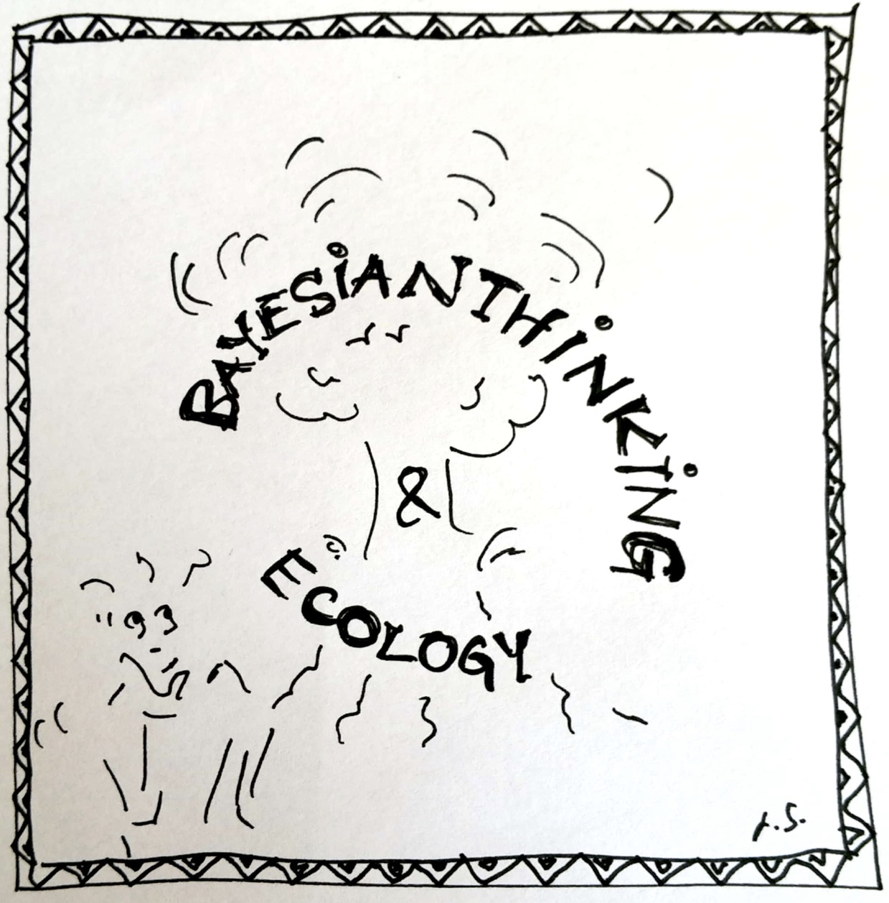

In early spring 2020 a group of young scientists will offer a workshop entitled „Bayesian Thinking & Ecology“ at the University of Zurich. The goal of the workshop is to bring together scientists from ecology and statistics in an interdisciplinary educational event with high level expert contributions and a focus on scientific output. 
We will explore the philosophy of Bayesian statistics and how it can be employed to deliver new insights to ecological questions. Our goal is not to provide an overview of all possible applications, but rather to train participants in Bayesian thinking and enable scientists to successfully apply Bayesian methods in new and creative ways. Furthermore, we aim to offer an inspiring selection of applications in the domain of ecological research and we invite experts to enrich this workshop with their valuable contributions. In this workshop, participants will learn what it means to think Bayesian, be exposed to exciting science and work together in teams with the goal to foster scientific collaboration. We therefore encourage experts to engage with us in the preparation phase to streamline this workshop as a high quality educational event and the basis for scientific publications. 
We promote transparent and reproducible science and the use of open source software. Course material will be provided on Git and the statistical software R will be most prominent throughout the workshop.
The three to four day workshop will target PhD students, but will be open for other level participants in agreement with the PhD program coordinator. However, the maximum number of participants will be kept to a size that ensures a comfortable working atmosphere. 
We, the organizers, are an interdisciplinary group of PhDs and Postdocs from the University of Zurich. Initiated by Leila Schuh and Gilles Kratzer from the applied statistics group, to workshop is jointly organized, also by Frank Pennekamp from the Department of Evolutionary Biology and Environmental Studies, Oliver Reader and Maarten Eppinga from Earth System Science and Dorothea Hug Peter from applied statistics.

# General information

**When:** Early spring 2020

**Where:** Zurich

**Requirements:** Basic knowledge of statistics and R programming language. Willingness to work with stae of the art software development tools (Markdown, git, )

**Organizers:** [Leila Schuh](https://www.math.uzh.ch/index.php?id=people&L=0&id=people&semId=37&key1=14654) & [Gilles Kratzer](https://gilleskratzer.netlify.com/) & Frank Pennekamp & Oliver Reader & Dorothea Hug Peter & Maarten Eppinga

**Contact:** [workshop organizer](mailto:leila.schuh@math.uzh.ch)

**Instructors:** TBA

# Expected learning outcomes

- enable participants to apply Bayesian methods in new and creative ways in Ecology
- foster collaboration
